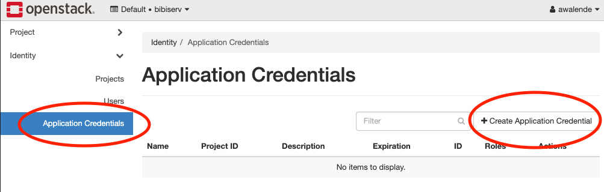
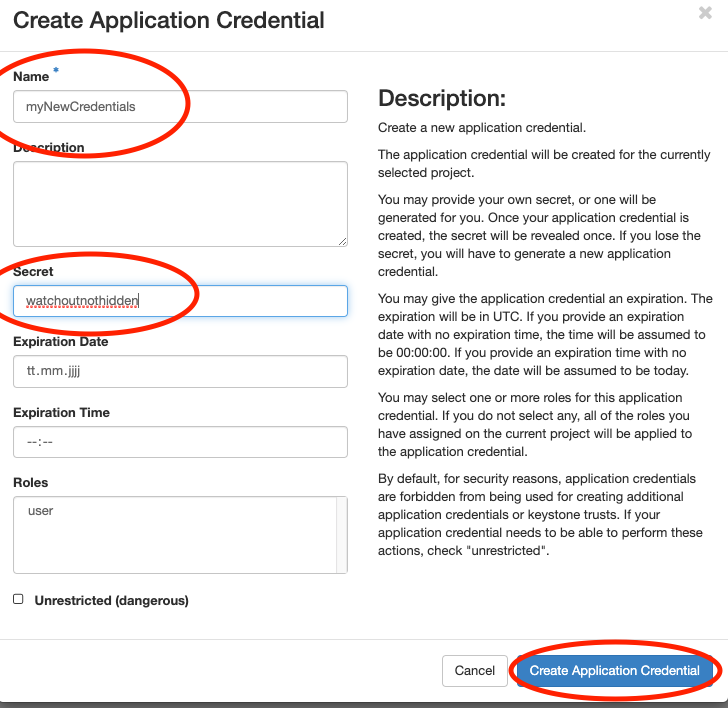
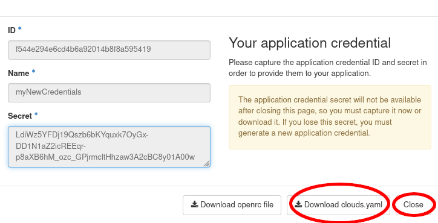
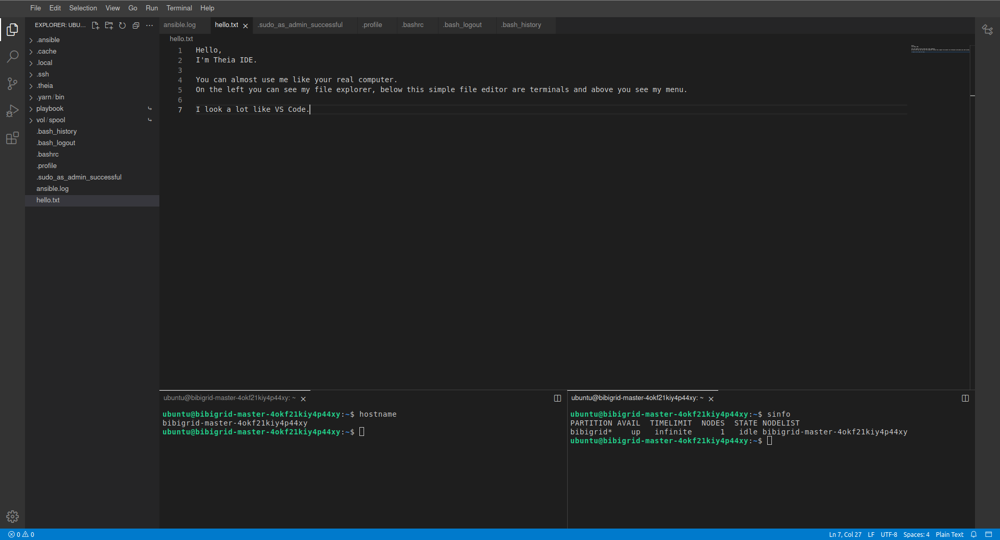

# Cloud User Meeting: BiBiGrid Hands-on - Two Hour Version

This tutorial is a reworked/optimized version of the Hands-on session of the **GCB 2019 in Heidelberg**
based on the latest release of BiBiGrid. You can find the longer version [here](https://github.com/deNBI/bibigrid_clum).

## Prerequisites

- System base on Linux, OSX (tested) or Windows Subsystem for Linux (untested)
- required software packages 
  - Python >= 3.10
  - git (required)
  - openssh 
- Openstack API access

## Clone bibigrid and bibigrid_clum
```shell
git clone https://github.com/BiBiServ/bibigrid.git
git clone https://github.com/deNBI/bibigrid_clum.git
```

Your bibigrid folder should contain:

```sh
$ ls bibigrid
# bibigrid Dockerfile-rest rebuild-lock-and-reqs.sh requirements.txt bibigrid_rest.sh documentation requirements-all.txt tests bibigrid.sh pyproject.toml   requirements-dev.txt uv.lock bibigrid.yaml README.md requirements-rest.txt
```

## What will happen...

The goal of this session is to set up a small HPC cluster consisting of 3 nodes (1 master, 2 [on demand](https://github.com/BiBiServ/bibigrid/blob/master/documentation/markdown/features/configuration.md#workerinstances) workers) using BiBiGrid with [Slurm](https://slurm.schedmd.com/quickstart.html) (workload manager), [Network File System](https://linux.die.net/man/5/nfs) (allows file sharing between servers) and [Theia](https://theia-ide.org/docs/user_getting_started/) (Web IDE). This tutorial targets users running BiBiGrid on de.NBI cloud.

1. [Preparation](#preparation)
2. [Configuration](#configuration)
3. [The Cluster](#the-cluster)

## Preparation

### Premade Template

Use the prefilled configuration template [resources/bibigrid.yaml](resources/bibigrid.yaml) as a basis for your personal BiBiGrid configuration. 
Later in this tutorial you will use [OpenStackClient](https://pypi.org/project/python-openstackclient/) or access 
Openstack's dashboard manually to get all necessary configuration information from your project.

Copy the [configuration template](resources/bibigrid.yaml) to `~/.config/bibigrid/`.

```shell
mkdir ~/.config/bibigrid
cp bibigrid_clum/resources/bibigrid.yaml ~/.config/bibigrid/bibigrid.yaml
```

This premade template includes volume keys for both master and worker, giving you a permanent volume for your master 
that is shared via nfs (see `nfsShares`) and one semipermanent volume for each worker.
Each volume is an SSD with 25 GB.

### OpenStack Authentication

In this section you will create an [application credential](https://access.redhat.com/documentation/zh-cn/red_hat_openstack_platform/14/html/users_and_identity_management_guide/application_credentials) and download the autogenerated `clouds.yaml`. `clouds.yaml` contains all required authentication information. Follow the images:



Don't use the input field secret.
- Its input is not hidden
- OpenStack will generate a strong secret for you, if you leave it blank.

Pick a sensible expiration date.





Save the downloaded `clouds.yaml` under `~/.config/openstack/` **and** `~/.config/bibigrid/`. That will allow both OpenstackClient and BiBiGrid to access it:
```sh
cp ~/Downloads/clouds.yaml ~/.config/bibigrid/clouds.yaml
mkdir ~/.config/openstack
cp ~/Downloads/clouds.yaml ~/.config/openstack/clouds.yaml
```

<details>
<summary>Why not store BiBiGrids clouds.yaml in openstack and avoid the extra copy?</summary>

In the future BiBiGrid will support more than just one cloud infrastructure. Therefore, using the `~/.config/openstack` folder would be a disadvantage later.
</details>

### Virtual Environment

A virtual environment is something that gives you everything you need to run specific programs without altering your system.

#### Creating a [Virtual Python Environment](https://docs.python.org/3/library/venv.html)

`python3 -m venv ~/.venv/bibigrid`

If this command fails, you probably need to install python3-venv manually. 
For that first update `sudo apt update && sudo apt upgrade` and then `sudo apt install python3.??-venv` (use the correct version for your system).

#### Sourcing Environments

In order to actually use the virtual environment we need to [source](https://www.theunixschool.com/2012/04/what-is-sourcing-file.html) that environment:

`source ~/.venv/bibigrid/bin/activate`

Following [pip](https://manpages.ubuntu.com/manpages/bionic/en/man1/pip.1.html) installations will only affect the virtual environment.
The virtual environment is only `sourced` in the terminal where you executed the source command. Other terminals are not affected.

#### Fulfilling Requirements

Now let's move into the bibigrid folder (`cd bibigrid`). We will stay in the bibigrid folder and in the terminal that sourced the virtual environment unless explicitly mentioned otherwise.

You will now install BiBiGrid as a package within your newly created virtual environment. If you haven't `sourced` your environment yet, please go [back](#sourcing-environments). Installing BiBiGrid as a package automatically installs all requirements:

`pip install -e .`

Try executing `openstack subnet list --os-cloud=openstack` within this environment. If it runs without errors, you are ready to proceed.

- **Cloud openstack was not found**: If you encounter this error, check your [clouds.yaml](#openstack-authentication). Have you really placed it here `~/.config/openstack/clouds.yaml` as well?
- **Command 'openstack' not found**: If you encounter this error, check that you really have sourced your [virtual environment](#virtual-environment) and have installed the bibigrid package in it.

## Update Configuration

Following the next steps you will update the [premade template](#premade-template).

<details>
<summary>Why are some keys in the template already set?</summary>

In this hands-on, we want to make things as easy as possible for you. Just check whether the key you've found is the correct one and matches with the one we've written down in the configuration file already.
</details>

### SSH access information

BiBiGrid needs to know which [sshUser](https://www.redhat.com/sysadmin/access-remote-systems-ssh) to use in order to connect to your master. You can set this key in your `~/.config/bibigrid/bibigrid.yaml` file. 

The [sshUser](https://www.redhat.com/sysadmin/access-remote-systems-ssh) depends on your server image. Since we run on top of Ubuntu 24.04 the ssh-user is `ubuntu`. Set the template's `sshUser` key to `ubuntu`.

### Network

We have created a subnet for this workshop for you. Determine your subnet's `Name` by running:

```sh
openstack subnet list --os-cloud=openstack
```

Set the template's `subnet` key to the result's `Name` key.

<details>
<summary>How do I create a subnet for my own project?</summary>

If you have your own project outside of this workshop and would like to create a subnet, take a look at the [OpenStack Quickstart from de.NBI Cloud Wiki](https://cloud.denbi.de/wiki/quickstart/#network-and-subnet). Depending on your cloud location, steps might slightly differ.
</details>

### Instances

BiBiGrid needs to know `type` and `image` for each server. Since those are often identical for the workers, 
you can simply use the `count` key to indicate multiple workers with the same `type` and `image`.

#### Image
Images are virtual disks with a bootable operating system. Choosing an image means choosing the operating 
system of your server.

Since [images](https://docs.openstack.org/image-guide/introduction.html) are often updated, you need to 
look up the current active image using:

```shell
openstack image list --os-cloud=openstack | grep active
```

Since we will use Ubuntu 24.04 you might as well use:

```shell
openstack image list --os-cloud=openstack | grep active | grep "Ubuntu 24.04"
```

Set the template's `image` key of all instances to the result's `ID`  **or** `NAME` entry of the Ubuntu 24.04 row. 
All servers will share the same image.

<details>
<summary>Do I have to update my configuration file whenever there is a new image version?</summary>

If you use the method described above, yes. However, you can also use a regex instead of a specific name to select an image during runtime. Using Regex also avoids issues that arise whenever an image is deactivated while your cluster is still running. For our Ubuntu 24.04 images you could use `^Ubuntu 24\.04 LTS \(.*\)$`, but usually you need to check what image names are available at your location and choose the regex accordingly. For more information on this functionality take a look at BiBiGrids [full documentation](https://github.com/BiBiServ/bibigrid/blob/master/documentation/markdown/features/configuration.md#using-regex).
</details>

#### Flavor

Flavors are available hardware configurations.

The following gives you a list of all flavors:

```shell
openstack flavor list --os-cloud=openstack
```

Set the template's `flavor` keys (provide an `ID` or `NAME` - we will use `NAME` in the following examples) to flavors of your choice - in this tutorial we will use `de.NBI medium` for our master and `de.NBI small` for our two workers. You can use a different flavor for the master and each worker-group.

<details>
<summary>Example: Multiple worker groups</summary>

The key `workerInstances` expects a list. Each list element is a `worker group` with an `image` + `type` combination and a `count`. In our tutorial we use a single worker group containing two workers. Since they are in the same worker group, they are identical in flavor and image. We could, however, define two worker groups with one worker each in order to use different flavors for them.

```shell
workerInstances:
  - type: de.NBI tiny
    image: ubuntu-24.04-image-name
    count: 1
  - type: de.NBI default
    image: ubuntu-24.04-image-name
    count: 1
```
</details>

### Waiting for post-launch Services

Some clouds run one or more post-launch services on every started instance, to finish the initialization after an 
instance is available (e.g. to configure local proxy settings or local available repositories). That might interrupt 
BiBiGrid setting up the node (via Ansible). Therefore, BiBiGrid needs to wait for your post-launch service(s) to finish. For that BiBiGrid needs the 
services' names. Set the key `waitForServices` to the list of services you would like to wait for. For Bielefeld 
this is `de.NBI_Bielefeld_environment.service`. Contact your cloud if you are unsure whether post-launch services exist at your location.

```yaml
  waitForServices: 
    - de.NBI_Bielefeld_environment.service
```

### Check Your Configuration
Run `bibigrid check -i bibigrid.yaml -v` to check your configuration. The command line argument 
`-v` allows for greater verbosity which will make it easier for you to fix issues.

## The Cluster
### Starting the cluster
`bibigrid create -i bibigrid.yaml -vv` creates the cluster with a verbose verbose output - great for us to see what's happening. Cluster creation time 
depends on the chosen flavor and the overall load of the cloud and will take up to 15 minutes. Create ends with a helpful output informing you on the follow up actions available.

### List Running Clusters
Since several clusters can run simultaneously in a single project, listing all running clusters can be useful:

Execute `bibigrid list -i bibigrid.yaml`. You will receive a general overview of all clusters started in your project. You will see your cluster there, but also the clusters of other users in the same project.

### Using Theia Web IDE

[Theia Web IDE's](https://www.theia-ide.org/) many features make it easier to work on your cloud instances. Take a look:




When enabled, Theia Web IDE is configured to listen on localhost port 8181 on the master instance. Since this address 
is not directly available, you have to forward it to your machine using ssh. However, BiBiGrid handles that for you. Simply execute 

```shell
bibigrid ide -i bibigrid.yaml
```

to connect to Theia. A Theia IDE tab will automatically open in your browser. You could have set `-cid [cluster-id]`. However, if no `-cid` is given, BiBiGrid will attempt to connect to your last created cluster which should be the cluster you just created.

Run `sinfo` on Theia's terminal. You should see something like this:

```sh
PARTITION AVAIL  TIMELIMIT  NODES  STATE NODELIST
openstack    up   infinite      2  idle~ bibigrid-worker-6jh83w0n3vsip90-[0-1]
openstack    up   infinite      1   idle bibigrid-master-6jh83w0n3vsip90
All*         up   infinite      2  idle~ bibigrid-worker-6jh83w0n3vsip90-[0-1]
All*         up   infinite      1   idle bibigrid-master-6jh83w0n3vsip90
```

<details>
<summary>Why are there two partitions (openstack and all) with the same nodes?</summary>

BiBiGrid creates one partition for every cloud (here `openstack`) and one partition called `all` containing all nodes from all partitions. Since we are only using one cloud for this tutorial, we only have `openstack` and `all`.
</details>

## Hello BiBiGrid, Hello Antibiotic Resistance!

In this section, you will execute the `resFinder` [Nextflow](https://www.nextflow.io/) workflow to create a heatmap of antibiotic resistances using your cluster. This workflow has been downloaded by the ansible user role `resistance_nextflow` which was predefined in the `bibigrid.yaml` template. While we use Nextflow in this hands-on, you can use any workflow language that can execute on Slurm with BiBiGrid.

### Ansible Let's Execute Our Role

Execute the workflow:

```shell
cd /vol/spool
./nextflow run resFinder.nf -profile slurm
```

The heatmap will be generated at `/vol/spool/outputs/collected_heatmaps/`.

## Terminate a cluster

Execute `bibigrid terminate -i bibigrid.yaml -cid [cluster-id] -v`. `bibigrid terminate -i bibigrid.yaml` also does the trick, since BiBiGrid will fall 
back on your last created cluster if no cluster-id is specified.

## Moving Forward

### More BiBiGrid

Congratulations! You have finished BiBiGrid's Two Hour Hands-on.

You may want to take a look at the "real" `bibigrid.yaml` inside BiBiGrid's repository. It has a lot more options. However, everything you have learned here stays true.

If you would like to deepen your knowledge maybe give BiBiGrid's [Features](https://gitlab.ub.uni-bielefeld.de/bibiserv/bibigrid/bibigrid2/-/blob/main/documentation/markdown/bibigrid_feature_list.md) or the [Software](https://gitlab.ub.uni-bielefeld.de/bibiserv/bibigrid/bibigrid2/-/blob/main/documentation/markdown/bibigrid_software_list.md) used by BiBiGrid a read. If you would like to know more about the configuration file see [Configuration](https://github.com/BiBiServ/bibigrid/blob/master/documentation/markdown/features/configuration.md).

### More Ansible
You can learn more about Ansible here:
- [de.NBI Cloud's Ansible Course](https://gitlab.ub.uni-bielefeld.de/denbi/ansible-course)
- [Getting started with Ansible](https://docs.ansible.com/ansible/latest/getting_started/index.html)
- [Ansible Galaxy](https://galaxy.ansible.com/ui/)

### I Have a Question or Feature Request
BiBiGrid issues can be opened [here](https://github.com/BiBiServ/bibigrid/issues). Feel free to contact us for support as well.
